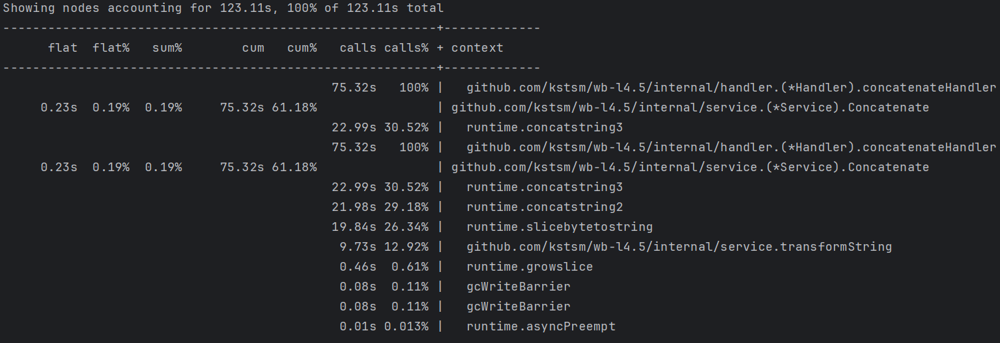
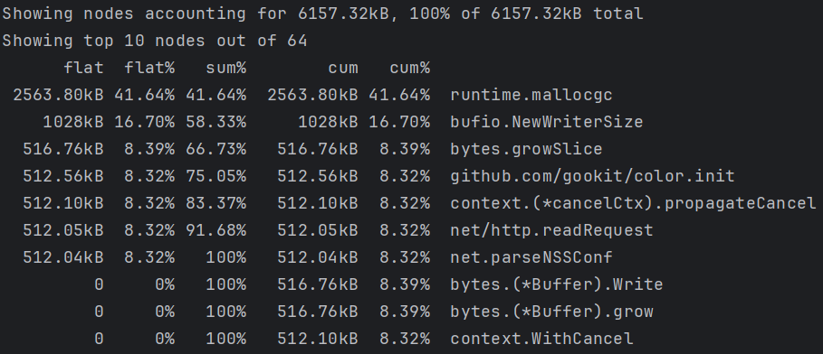

# Оптимизация HTTP API

Проект демонстрирует процесс профилирования и оптимизации HTTP API.  
Цель: выявить узкие места по CPU и памяти и подготовить базу для оптимизации.

## Используемые инструменты

- **pprof** и **net/http/pprof** - профилирование CPU и памяти (эндпоинты на отдельном порту)
- **benchstat** и **go test -bench** - бенчмарки и сравнение результатов до/после оптимизации
- **go tool trace** - анализ trace (горутины, блокировки, GC, распределение по времени)

## Установка и запуск проекта

### 1. Клонирование репозитория

```bash
git clone https://github.com/kstsm/wb-l4.5
cd wb-l4.5
```

### 2. Настройка переменных окружения

Создайте `.env` файл по образцу `.example.env`:

```bash
cp .example.env .env
```

Отредактируйте `.env` файл, указав необходимые значения:
- `SRV_HOST` - хост сервера (по умолчанию: localhost)
- `SRV_PORT` - порт сервера (по умолчанию: 8080)
- `PPROF_HOST` - хост pprof (по умолчанию: localhost)
- `PPROF_PORT` - порт pprof (по умолчанию: 6060)

### 3. Запуск сервера

```bash
make run
```

Сервер будет доступен на `http://localhost:8080`, pprof на `http://localhost:6060`.

## API запросы

### POST /concatenate - обработка и конкатенация строк

Функция принимает массив строк, трансформирует каждую строку (добавляет заглавные буквы), создает обратную копию и объединяет результаты через разделитель.

**URL:** `http://localhost:8080/concatenate`

**Запрос:**
```json
{
  "items": ["hello", "world", "test"]
}
```

**Ответ:**
```json
{
  "result": "hHeElLlLoO|oOlLlLeEhH|tTeEsStT|tTsSeEtT"
}
```
## Профилирование

### CPU профилирование

Для получения релевантных результатов профилирования необходимо создавать нагрузку на API во время профилирования.
1. Запустите сервер в одном терминале:
   ```bash
   make run
   ```
   
2. В другом терминале запустите нагрузку с большим количеством данных:
   ```bash
   hey -n 500000 -c 200 -m POST \
     -H "Content-Type: application/json" \
     -d '{"items":["hello","world","test","optimization","benchmark","performance","profiling","cpu","memory","allocation","concatenation","string","builder","golang","go","runtime","pprof","trace","analysis"]}' \
     http://localhost:8080/concatenate
   ```

3. Во время работы нагрузки в третьем терминале запустите профилирование:
   ```bash
   go tool pprof http://localhost:6060/debug/pprof/profile?seconds=30
   ```

   Затем в интерактивном режиме используйте:
   ```bash
   (pprof) peek Concatenate
   ```
   Это покажет функцию с аннотациями CPU даже если она не в топ-10.

### Профилирование памяти

Для анализа использования памяти:

```bash
make profile-mem
```

Или напрямую:
```bash
go tool pprof http://localhost:6060/debug/pprof/heap
```

В интерактивном режиме используйте команды:
- `top` - топ функций по памяти
- `list Service.Concatenate` - просмотр кода функции с аннотациями памяти
- `alloc_space` - анализ выделенной памяти
- `inuse_space` - анализ используемой памяти


### Профилирование бенчмарков

Для профилирования конкретной функции используйте бенчмарки с CPU профилированием:

```bash
cd internal/service
go test -bench=BenchmarkConcatenate -cpuprofile=cpu.prof -benchmem
go tool pprof cpu.prof
```

### Анализ trace

Для анализа выполнения программы используется `go tool trace` и эндпоинт pprof `/debug/pprof/trace`:

```bash
make profile-trace
make trace-analyze
```

Или вручную (сервер должен быть запущен, при необходимости создайте нагрузку в другом терминале):

```bash
curl -o benchmarks/trace.out http://localhost:6060/debug/pprof/trace?seconds=10
go tool trace benchmarks/trace.out
```

В открывшемся браузере доступны: View trace (временная шкала), Goroutine analysis, Network blocking profile и др. Trace позволяет увидеть:
- Взаимодействие горутин
- Блокировки и ожидания
- Распределение работы по времени
- GC паузы

## Бенчмарки

Для сравнения производительности до и после оптимизации используются бенчмарки:

### Запуск бенчмарков до оптимизации

```bash
make bench-before
```

### Запуск бенчмарков после оптимизации

```bash
make bench-after
```

### Сравнение результатов

```bash
make bench-compare
```

Используется `benchstat` для сравнения результатов бенчмарков. Установка:

```bash
go install golang.org/x/perf/cmd/benchstat@latest
```

Файлы `before.txt` и `after.txt` создаются целями `make bench-before` и `make bench-after` соответственно.

Запуск бенчмарков вручную:
```bash
go test -bench=BenchmarkConcatenate -benchmem -count=6 ./internal/service
```

## До оптимизации проекта

### CPU
При анализе CPU-профиля (pprof) было выявлено, 
что основная нагрузка приходится на метод Service.Concatenate.
Большая часть времени выполнения тратится на операции конкатенации строк (runtime.concatstring*)
и преобразования []byte в string.

Это связано с тем, что строки объединяются в цикле через оператор +,
а также используются избыточные преобразования типов (string([]byte(...))).
Такие операции создают большое количество аллокаций
и приводят к значительной нагрузке на CPU.



# Память
Анализ heap-профиля показал, что основная часть памяти
уходит на динамическое выделение объектов (runtime.mallocgc)
и рост срезов (bytes.growSlice) в процессе конкатенации строк.
Статические пакеты и системные структуры занимают меньше памяти.
Оптимизация возможна за счёт уменьшения аллокаций и использования
strings.Builder.




